# 【C/C++ 新手避坑指南】之三

龙爸写给**初学 C/C++** 的朋友们的**新手避坑指南**，扫平入门的几个大障碍的**极简教程**：

1. 《**极简安装配置 C/C++ 编译环境**》：[Github 最新更新](https://github.com/coffeescholar/C_CPP-Learning/blob/main/CBeginnerHelper/C_Cpp_Beginners_Guide.md) | [PDF版下载](https://github.com/coffeescholar/C_CPP-Learning/blob/main/CBeginnerHelper/C_Cpp_Beginners_Guide.pdf) | [知乎专栏](https://zhuanlan.zhihu.com/p/688782325)

2. 《**极简安装配置 VSCode：中文、C/C++扩展、乱码**》：[Github 最新更新](https://github.com/coffeescholar/C_CPP-Learning/blob/main/CBeginnerHelper/VSCode_C_Cpp_HelloWorld.md) | [PDF版下载](https://github.com/coffeescholar/C_CPP-Learning/blob/main/CBeginnerHelper/VSCode_C_Cpp_HelloWorld.pdf) | [知乎专栏](https://zhuanlan.zhihu.com/p/688869789)

3. 《**美丽的终端：最新 Terminal 美化指南**》：[Github 最新更新](https://github.com/coffeescholar/C_CPP-Learning/blob/main/CBeginnerHelper/Beautiful_Terminal.md) | [PDF版下载](https://github.com/coffeescholar/C_CPP-Learning/blob/main/CBeginnerHelper/Beautiful_Terminal.pdf) | [知乎专栏](https://zhuanlan.zhihu.com/p/688869789)

4. **方便设置 Path 环境变量的脚本**：在 Path 环境变量中查看、查找、添加、删除——[使用说明](https://github.com/coffeescholar/C_CPP-Learning/blob/main/CBeginnerHelper/Readme.md) | [PDF版下载](https://github.com/coffeescholar/C_CPP-Learning/blob/main/CBeginnerHelper/Readme.pdf)

5. **算法入门练习题**（陆续完善中）：《[陪小学生学习 Python 练习题](https://github.com/xiaohaimiao/Python-Learning)》、《[陪小学生学习 C/C++ 练习题](https://github.com/coffeescholar/C_CPP-Learning)》

原文发布、维护于龙爸**陪孩子学习 `Python`、`C++` 的练习项目**:

- [coffeescholar/C_CPP-Learning](https://github.com/coffeescholar/C_CPP-Learning)，作者：[爱学习的龙爸](https://github.com/coffeescholar)

- 欢迎意见、建议和帮助，谢谢 🥰💕❤️

- 如果对你有帮助，请支持 Star~ ✨✨✨

- 转载时请保留声明和出处，谢谢 🤝🤝🤝

- 如果是 `Github`、`MarkText`、`PDF` 等，请打开目录方便阅读 😎

---

> 互联网网络上最麻烦的一点是信息太多，良莠不齐，准确筛选出你所需要的，不得不话一点儿时间、精力，甚至走点儿弯路。
> 
> 很多教程还是基于 `Oh-My-Posh 2`，而不是最新版。当初装老版本的时候，也是遇到了不少问题。
> 
> 现在，虽然针对最新版也陆续出现了一些不错的教程，但龙爸还是考虑辛苦一下重写一份指南，并标记好日期，避免后人再走弯路。
> 
> ——龙爸，于 2024 年 3 月底

---

# 美丽强大的终端

# 一、关于终端

## 1. 什么是终端？

> `终端` 通常指的是一个用于输入命令或显示系统输出的界面，人与计算机通过基于文字和字符组成的命令和信息进行交互。
> 
> 区别于终端，图形用户界面（GUI）环境中，人通常采用鼠标、手势触摸等方式进行操作。

以常用的 `Windows` 为例，其中的 `Command Prompt`（常被简称为 `CMD`）译作【`命令提示符`】，就是一种终端：

（如图）

## 2. Windows 的终端很多？

其实不多，但的确是容易混淆，下面一起来把它们分清楚：

1. `Command Prompt`（命令提示符，又称为 `CMD`）：微软公司的 `Windows` 系统最早内置的 `CMD` 来源于 `Windows` 之前的微软 `MSDOS` 操作系统，这里先不展开；

2. `Windows PowerShell`：`Windows 10` 提供了更为强大的 `Windows PowerShell` 终端，对应着 `PowerShell 5.1` 版本；

3. `PowerShell`：到了 `Windows 11`，内置的 `Windows PowerShell` 升级到了 `7.1` 版，名字中去掉了 `Windows`——因为从此跨平台，不再仅仅用于 `Windows`。

目前为止，与 `Windows` 相关的终端有三种，关系如下：

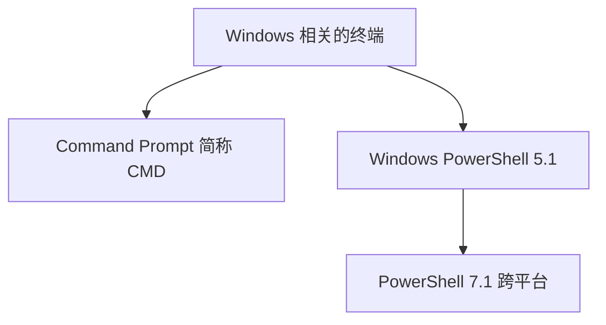

注意：`Windows` 之外的其它系统，还有更多种终端，这里就不展开了。

## 3. Windows 终端？大混乱

微软公司后来又提供了一款名为 `Windows Terminal`（译为 `Windows 终端`）的终端管理和应用工具软件：

> `Windows Terminal` 是一个新的、现代化的、功能丰富、高效的<u>**终端应用程序**</u>，**用于启动和使用**多种不同的命令行工具和终端，包括：
> 
> + `命令提示符` `Command Prompt (CMD)`
> 
> + `PowerShell`
> 
> + `WSL (Windows Subsystem for Linux)` 等等

仔细看看就不会混淆了：

> `Windows Terminal` 名字叫【`Windows 终端`】，其实不是 `终端`，——**是统一访问和使用这些终端的工具软件**。 

以下是它们之间的关系：

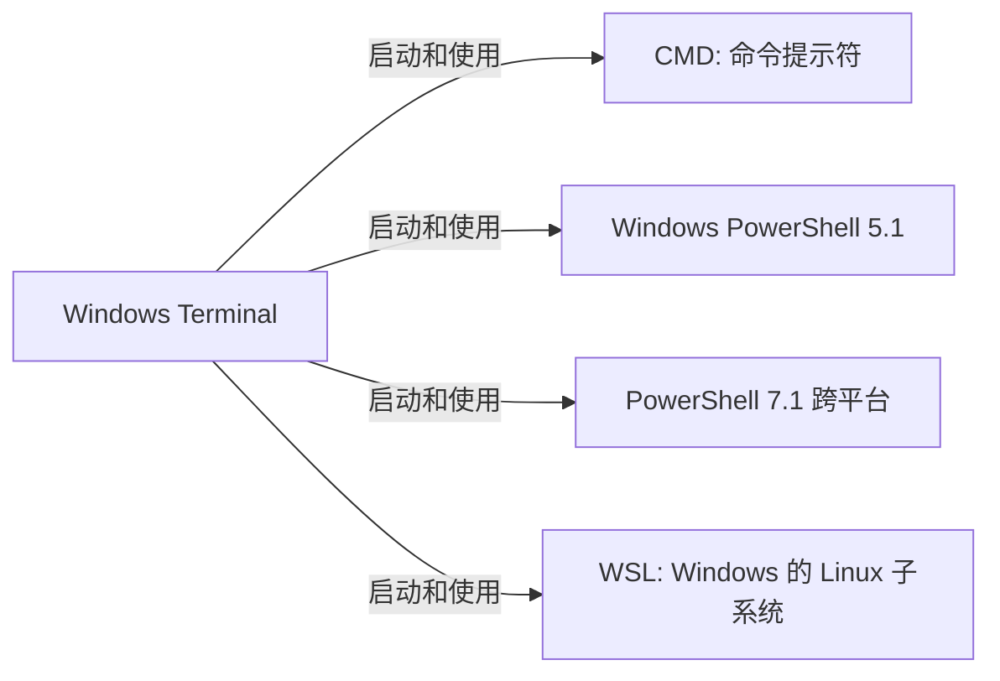

`Windows Terminal` 提供了一个**统一的界面**，可以用来启动和使用**多种不同**的命令行工具、终端，并在不同的 Tab 形式窗口中**同时使用**。

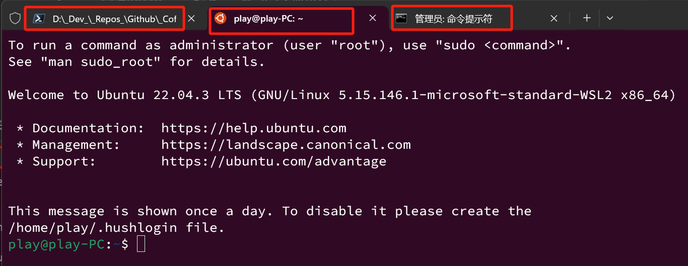

——可以直接直接使用 `CMD`、`PowerShell`，也可以通过 `Windows Terminal` 这个**统一界面、支持多终端**的工具来使用它们。

## 4. 安装 PowerShell 和 Windows Terminal

**如果你使用的是 `Windows 10`，建议：**

+ 安装 `PowerShell 7.x` 以后版本并保持升级——可在系统自带的微软应用商店里搜索并安装，也可以在 `Github` 下载安装；

+ 安装 `Windows Terminal` 并保持升级——可在系统自带的微软应用商店里搜索并安装，也可以在 `Github` 下载安装，还可以用 `Scoop` 安装：

```powershell
# 如果之前没有添加过 extras 源则添加
scoop bucket add extras
# 安装 Windows Terminal
scoop install windows-terminal
```

有点儿意思的是 `Scoop` 提供的 `Windows Terminal` 版本比微软商店里的版本略新，`Scoop` 的软件包主要来源就是 `Github`。

推测因为 `Windows Terminal` 是微软发布在 `Github` 的开源项目，所以 `Github` 上是最新版本，而稍晚一点儿才上架到微软商店。

> 微软的 `PowerShell`、`Windows Terminal` 都是**开源项目**，下面是它们在 `Github` 的项目地址：
> 
> [GitHub - PowerShell/PowerShell: PowerShell for every system!](https://github.com/PowerShell/PowerShell)
> 
> [GitHub - microsoft/terminal: The new Windows Terminal and the original Windows console host, all in the same place!](https://github.com/microsoft/terminal)

## 4. VSCode 里的终端

等等，怎么又冒出来终端了？`VSCode` 内置终端如图：

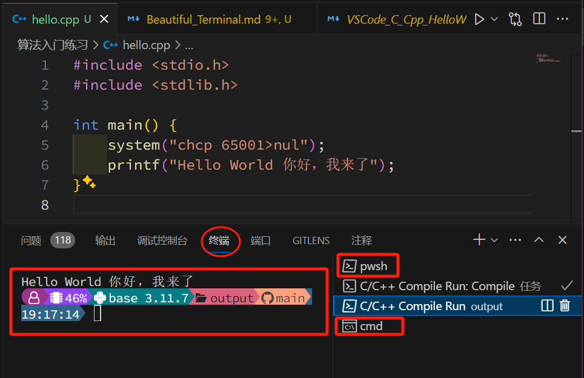

点加号旁边的下箭头，菜单中能看到 `VSCode` 支持的多个终端：

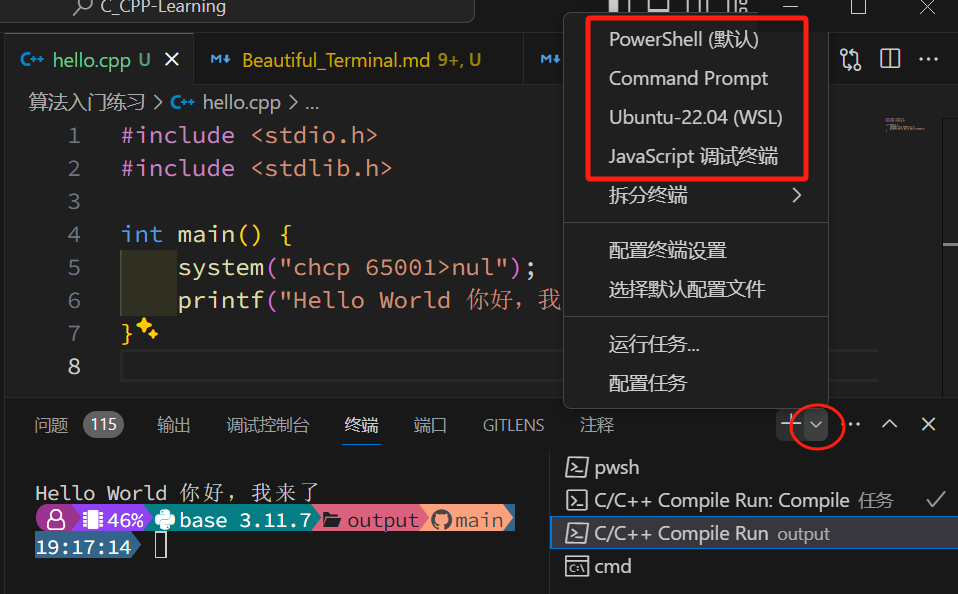

——可见并不是新的终端，而是我的 `Windows` 系统里的几个终端（图中的 `pwsh` 是 `PowerShell` 的缩写）。

> `VSCode` 里的终端，是调用了 `Windows` 系统中已经安装的终端，例如 `CMD` 和 `PowerShell`。

# 二、美化终端

详细看看美化过的终端（上图中已经出现）：

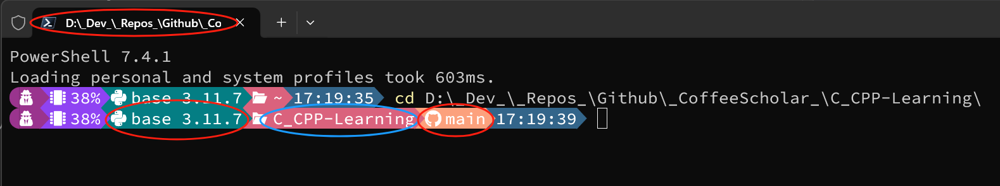

顶部是完整路径（没有显示完整），从左到右，分别是：

+ 系统管理员/用户

+ 内存占用

+ `Python` 的虚拟环境和版本

+ 当前文件夹

+ 当前 `Git` 分支

+ 当前时间

可以根据自己的需要调配颜色，去掉或者增加一些有用的信息，甚至可以显示天气信息（虽然没必要）。

美丽，又强大，是不是很有意思？

——接下来，美化你的终端。

> 网络上有很多教程，还是老毛病：老旧、错误、复杂，下面是经过仔细测试、简化的内容。

## 1. 安装 Oh-My-Posh 3

美化终端，主要是用 `Oh-My-Posh` 这款小工具来美化 `PowerShell`——在 `Windows Terminal` 和 `VSCode` 里就能看到效果。

> `Oh-My-Posh` 是一个用于美化 `PowerShell` 提示符的软件，它提供了许多可自定义的主题和功能，让你的 `PowerShell` 界面更加美观和实用。

可以用系统自带的应用商店搜索并安装 `Oh-My-Posh`，也可以用 `Scoop` 安装，在**非管理员终端**中执行：

```powershell
# 安装
scoop install oh-my-posh
# 查看详细信息
scoop info oh-my-posh
```

## 2. 安装所需的字体

### 2.1. 为何需要安装字体

因为 `Oh-My-Posh` 中这些漂亮的图标**需要特殊字体支持**：

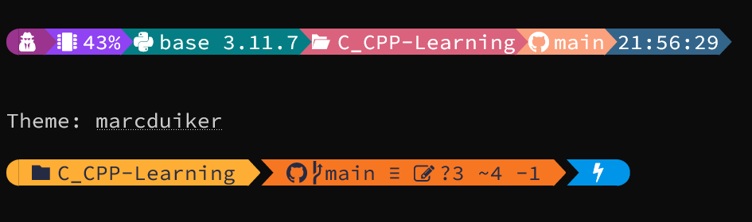

当前系统中没有 `Nerd` 系列的字体，就看不到这些有趣的图标。

> `Nerd Fonts` 是一个**开源项目**，它将一系列**图标和符号**添加到各种**流行的字体**中——这些图标和符号对程序员来说非常有用。
> 
> 将这些字体用在代码编辑器和终端中，可以使程序员的工作环境更美观、更具个性化，心情更加愉悦。
> 
> 项目提供了很多选择，包括 `Source Code Pro,` `DejaVu Sans Mono` 等著名的编程字体——这意味着可以在使用自己喜欢的字体同时，享受 `Nerd Fonts` 提供的额外图标。

### 2.2. 安装字体

#### A. 最简单的方式

在 `PowerShell` 中运行下面的命令：

```powershell
oh-my-posh font install
```

出现下面的 `文字菜单` ，上下选择、回车确定，如果嫌太慢—— `H` 和 `L` 可以**前后翻页**。


确认后，将自动下载对应字体。

> 绝大部分字体属于开源字体，托管在开源社区平台 `Github`，所以网络状态未必能保证。
> 
> 有很多热心网友将下载好的字体共享在国内的网盘，自行搜一下你感兴趣的字体下载吧。

可见，如果你已经很清楚需要什么字体，**这是最简单的方式**。

#### B. 又见 Scoop

是的，`Scoop` 支持安装 `Nerd Fonts`。

首先，需要添加额外的 `bucket`（软件包源）。

在 `PowerShell` 中执行以下命令，添加名为 `nerd-fonts` 的 `bucket` 然后安装：

<POWERSHELL>

```powershell
# 添加 Nerd 字体源
scoop bucket add nerd-fonts
# 安装名为 'DroidSansMono-NF' 的字体
scoop install DroidSansMono-NF
```

同样，如果你已经很清楚需要什么字体，已经在使用 `Scoop`，**这也是最简单的方式**。

#### C. 关键：有哪些字体？

请参考 `Nerd Font` 官网：[https://www.nerdfonts.com/font-downloads]()

点击 `Preview` 预览效果，看到喜欢的直接 `Download` 下载吧：

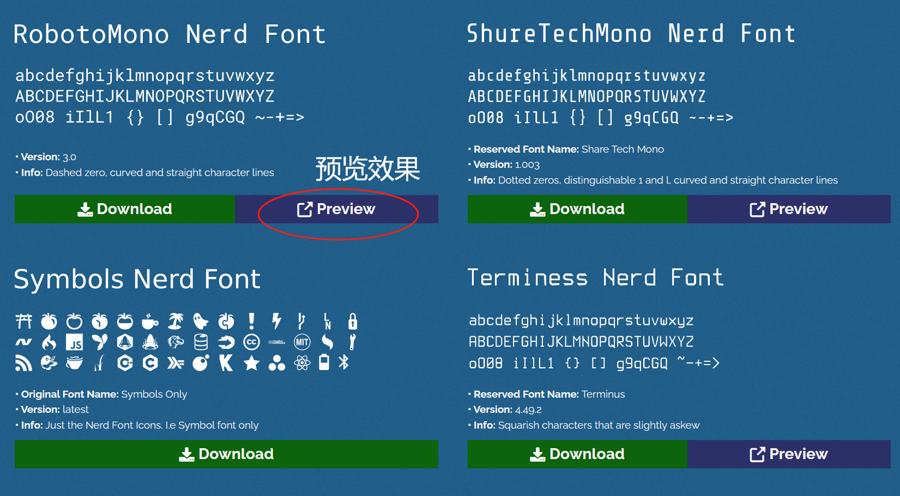

然后，接下来是最棒的部分：自动访问 [programmingfonts.org](https://www.programmingfonts.org) 预览字体 😎

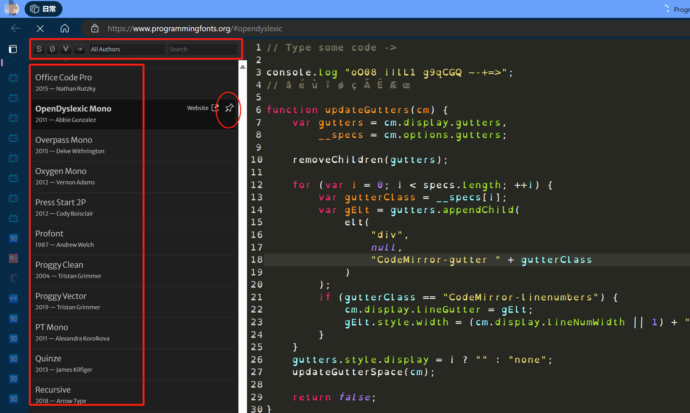

> `ProgrammingFonts.org` 是一个提供各种专为程序员设计的字体的网站——帮助程序员选择最适合自己的编程字体。
> 
> 字体在编程中起着重要作用，设计精良的字体可以提高代码的可读性，从而提高编程效率。
> 
> 在 `ProgrammingFonts.org`，可以预览各种编程字体，查看关于字体设计、可读性、字距和其它特性的详细信息和字体下载链接和使用建议。
> 
> 还可以输入代码，选择字体和大小，直接在网页上预览字体效果。

显然，这是**最赏心悦目的方式**，选择恐惧症患者请自觉放弃 😂🤗💕

### 2.3. 配置 Windows Terminal 字体设置

运行 `Windows Terminal` 按下快捷键 `Ctrl + , ` 或在其菜单中打开 `设置`，找到 `配置文件 > 默认值 > 外观`，设置已经安装了的 `Nerd` 字体：

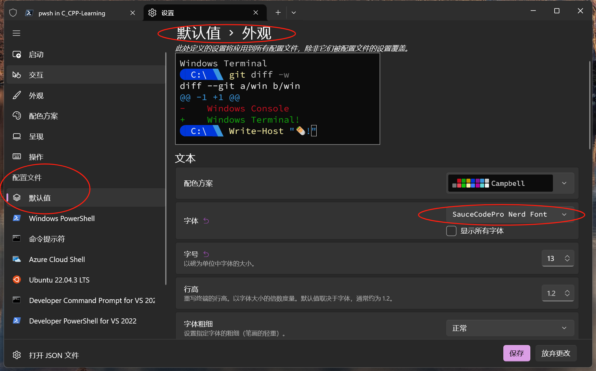

此时再看，就能看到那些可爱的图标了。

### 2.4. 配置 VSCode 字体设置

`VSCode` 也需要设置字体，因为它虽然调用了 `PowerShell` 等终端，但有独立的配置。

在 `VSCode` 中按下快捷键 `Ctrl + ,`  或在其菜单中打开 `文件 > 首选项 > 设置`，搜索 `editor.fontFamily`：

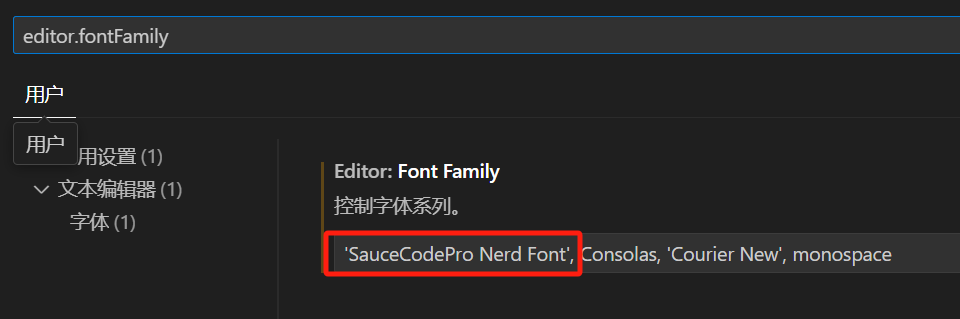

再搜索 `terminal.integrated.fontFamily`：

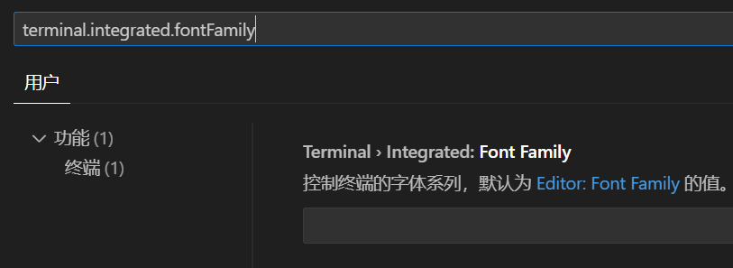

> 注意：`editor.fontFamily` 配置 `VSCode` 代码编辑器的字体。
> 
> 而 `terminal.integrated.fontFamily` 配置 `VSCode` 集成终端的字体。
> 
> 如果希望仅仅更改集成终端的字体，则在`terminal.integrated.fontFamily` 中设置字体名称；
> 
> 反之，如果都想更改，则在`editor.fontFamily` 中设置字体名称，集成终端将自动继承设置。

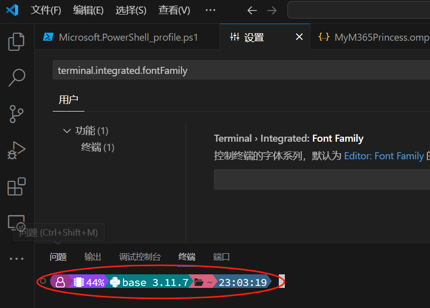

符号图标正常显示，配置完成。

### 2.5. ~~推荐字体~~？选择建议

选择 `Nerd` 字体时主要从以下几个方面进行考虑：

1. **可读性**：字体的设计应该易于阅读，特别是在长时间的编程工作中。字体的设计应该避免让相似的字符（比如数字 `1` 和小写字母 `l` ）看起来过于相似；

2. **美观**：虽然这是一个主观的标准，但是选择你觉得看起来舒服、美观的字体，可以提高你的编程效率和体验。

3. **宽度**：对于编程来说，等宽字体通常是更好的选择，因为它们可以让代码更整齐，更易于阅读。

4. **符号和图标**：`Nerd` 字体的一大特点就是包含了大量的符号和图标。可以根据你是否需要这些符号和图标，以及它们的设计是否满足你的需求，来选择字体。

5. **连字特性** ：有的人喜欢，有的人不喜欢，请自行选择。

> **连字特性 `ligature`**
> 
> 可以让某些编程符号（如箭头符号，比较符号等）显示得更加美观，例如 `>=` 显示出来等同于 `≥` 却又不违反编程语言的语法。

例如，`Fira Code Nerd Font` 是一款非常受欢迎的字体。它基于 `Fira Mono` 字体，增加了连字 `ligature` 特性。

同时，它也包括了 `Nerd Fonts` 的图标集，可以让终端看起来更加炫酷。


当然，最重要的是选择一款你自己喜欢和舒适的字体。

你可以尝试不同的 Nerd 字体，找到最适合你的那一款。

## 3. 简单配置 PowerShell

> 注意：如果是 `Windows 10` 系统，建议单独安装 `PowerShell 7.x` 版本（例如在微软应用商店中搜索、安装）。
> 
> 不建议停留在 `Windows 10` 自带的 `Windows PowerShell 5.1` 版本。

### 3.1. 创建 PowerShell 配置文件

在 `PowerShell` 中执行下面命令：

```powershell
# 如果没有 Powershell 配置文件则创建配置文件
if (!(Test-Path -Path $PROFILE )) { New-Item -Type File -Path $PROFILE -Force }
```

`PowerShell` 配置文件主要用于每次打开 `PowerShell` 终端时自动执行的命令。

比如，运行 `Oh-My-Posh` 并采用指定的主题风格。

### 3.2. 编辑 PowerShell 配置文件

在 `PowerShell` 中执行下面的命令（二选一）：

```powershell
# 如果安装了 VSCode 则使用 VSCode
code $profile
# 如果没有安装 VSCode 则使用系统自带的记事本
notepad $profile
```

将下面一行命令粘贴到上一步打开的 `PowerShell` 配置文件中（采用指定的主题）：

```powershell
oh-my-posh init pwsh --config "$env:POSH_THEMES_PATH\jandedobbeleer.omp.json" | Invoke-Expression 
```

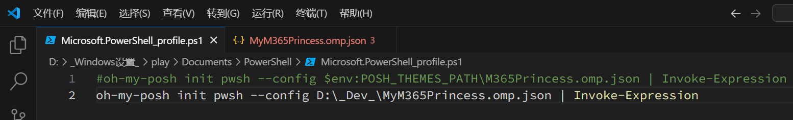

保存，关闭，然后打开新的 `PowerShell` 终端，或从 `Windows Terminal` 中打开，正常的话已经能看到效果。

# 三、 定制终端

## 1. 查看有哪些主题

在 `PowerShell` 中执行下面的命令：

```powershell
Get-PoshThemes
```

然后，`Oh-My-Posh` 自动把所有支持的主题都演示了一遍，让你眼花缭乱。

遇到喜欢的，复制主题名字，替换前面的命令，先在 `PowerShell` 里运行测试一下效果：

```powershell
oh-my-posh init pwsh --config "$env:POSH_THEMES_PATH\M365Princess.omp.json" | Invoke-Expression
```

确认后，更新到 `PowerShell` 配置文件中，见 `二、3.2`（就是让 `PowerShell` 每次打开时执行上面这行命令） 。

> 眼花缭乱就对了，官方网站上提供了所有主题的图片，方便查看：[https://ohmyposh.dev/docs/themes]()

## 3. 使配置生效

方法一：关闭 `PowerShell` 终端，再打开；

方法二：在 `PowerShell` 中执行下面的命令：

```powershell
. $PROFILE
```

> 调试自己定制的风格时，方法二 是很方便的技巧。

## 3. 增强配置

环境变量 `$env:POSH_THEMES_PATH` 中保存了 `Oh-My-Posh` 的存储位置，如：

```powershell
# 切换到保存主题的文件夹
cd $env:POSH_THEMES_PATH\M365Princess.omp.json
```

快速打开特定主题的配置文件进行编辑：

```powershell
# 用 VSCode 打开特定主题的配置文件
code $env:POSH_THEMES_PATH\M365Princess.omp.json
```

修改完成后，运行前面 `三、2` 命令使配置生效，**不用关闭终端，方便对比前后的效果**。

> 不妨多看看别人的主题配置，可以借鉴到不少好东西；
> 
> 另外最好把你改过的配置另存一份，不要被覆盖了；
> 
> 记得修改 `PowerShell` 启动命令里的文件路径和名字。

## 5. 扩展配置举例

在打开的特定主题的配置文件中，找到 `blocks` 数组：

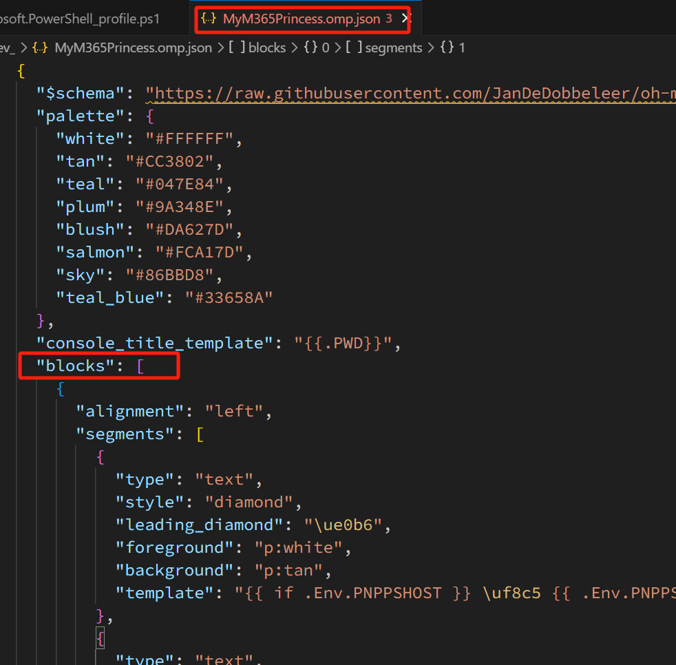

里面有多段 `{  }` ，一般在第二段里，找到第二段的 `segments ` 插入针对 `Python` 虚拟环境的配置：

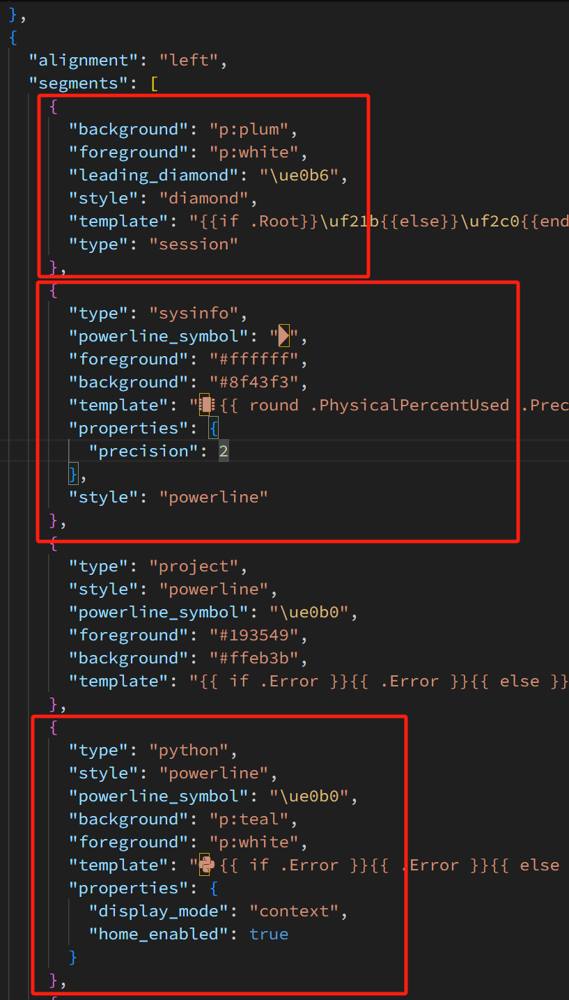

上面三段配置分别是：

### 5.1. 用户角色

可以用 `{{ .UserName }}` 显示当前用户名：

```json
{
    "background": "p:plum",
    "foreground": "p:white",
    "leading_diamond": "\ue0b6",
    "style": "diamond",
    "template": "{{if .Root}}\uf21b{{else}}\uf2c0{{end}} ",
    "type": "session"
},
```

显然，我知道自己是谁，就不需要显示用户名了，节约长度吧。

### 5.2. 系统信息

显示内存占用百分比：

```json
{
    "type": "sysinfo",
    "powerline_symbol": "",
    "foreground": "#ffffff",
    "background": "#8f43f3",
    "template": " {{ round .PhysicalPercentUsed .Precision }}%",
    "properties": {
        precision": 2
    },
    "style": "powerline"
},
```

### 5.3. Python 虚拟环境

```json
{
    "type": "python",
    "style": "powerline",
    "powerline_symbol": "\ue0b0",
    "background": "p:teal",
    "foreground": "p:white",
    "template": " {{ if .Error }}{{ .Error }}{{ else }}{{ if .Venv }}{{ .Venv }} {{ end }}{{ .Full }}{{ end }}",
    "properties": {
        "display_mode": "context",
        "home_enabled": true
    }
},
```

学习 Python 的朋友，虚拟环境很方便，回头另外介绍。

### 5.4. 设置终端标题的模板

在 `blocks` 前面添加：

```json
"console_title_template": "{{.PWD}}",
```

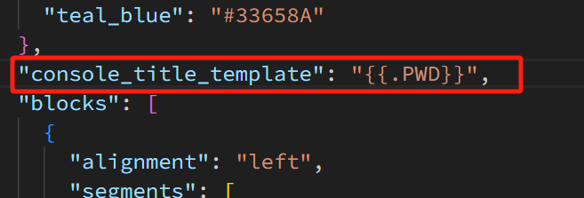

本例是完整显示当前路径，一般来说显示不完整，但搭配提示符中显示了当前文件夹名字，刚好。

### 5.5. 更多自由扩展

除了 `Python` 其它语言？其它环境，是不是也可以配置？

可以的，详见官方提供的指南和参考案例：

https://ohmyposh.dev/docs/segments/cmake

上面是 `CMake` 的例子，后续多个 `C/C++` 文件的编译就要用到 `CMake` 了。