# 【C/C++ 新手避坑指南】之二

龙爸写给**初学 C/C++** 的朋友们的**新手避坑指南**，扫平入门的几个大障碍的**极简教程**：

1. 《**极简安装配置 C/C++ 编译环境**》：[Github 最新更新](https://github.com/coffeescholar/C_CPP-Learning/blob/main/CBeginnerHelper/C_Cpp_Beginners_Guide.md) | [PDF版下载](https://github.com/coffeescholar/C_CPP-Learning/blob/main/CBeginnerHelper/C_Cpp_Beginners_Guide.pdf) | [知乎专栏](https://zhuanlan.zhihu.com/p/688782325)

2. 《**极简安装配置 VSCode：中文、C/C++扩展、乱码**》：[Github 最新更新](https://github.com/coffeescholar/C_CPP-Learning/blob/main/CBeginnerHelper/VSCode_C_Cpp_HelloWorld.md) | [PDF版下载](https://github.com/coffeescholar/C_CPP-Learning/blob/main/CBeginnerHelper/VSCode_C_Cpp_HelloWorld.pdf) | [知乎专栏](https://zhuanlan.zhihu.com/p/688869789)

3. 《**美丽的终端：最新 Terminal 美化指南**》：[Github 最新更新](https://github.com/coffeescholar/C_CPP-Learning/blob/main/CBeginnerHelper/Beautiful_Terminal.md) | [PDF版下载](https://github.com/coffeescholar/C_CPP-Learning/blob/main/CBeginnerHelper/Beautiful_Terminal.pdf) | [知乎专栏](https://zhuanlan.zhihu.com/p/688869789)

4. **方便设置 Path 环境变量的脚本**：在 Path 环境变量中查看、查找、添加、删除——[使用说明](https://github.com/coffeescholar/C_CPP-Learning/blob/main/CBeginnerHelper/Readme.md) | [PDF版下载](https://github.com/coffeescholar/C_CPP-Learning/blob/main/CBeginnerHelper/Readme.pdf)

5. **算法入门练习题**（陆续完善中）：《[陪小学生学习 Python 练习题](https://github.com/xiaohaimiao/Python-Learning)》、《[陪小学生学习 C/C++ 练习题](https://github.com/coffeescholar/C_CPP-Learning)》

原文发布、维护于龙爸**陪孩子学习 `Python`、`C++` 的练习项目**:

- [coffeescholar/C_CPP-Learning](https://github.com/coffeescholar/C_CPP-Learning)，作者：[爱学习的龙爸](https://github.com/coffeescholar)

- 欢迎意见、建议和帮助，谢谢 🥰💕❤️

- 如果对你有帮助，请支持 Star~ ✨✨✨

- 转载时请保留声明和出处，谢谢 🤝🤝🤝

- 如果是 `Github`、`MarkText`、`PDF` 等，请打开目录方便阅读 😎

---

# 极简安装配置 VSCode：中文、C/C++扩展、乱码

> 本教程不同于其它教程，相对更加简单，也不容易出现意外。
> 
> 但因为面向小学生、初中生小朋友，所以详细步骤会比较详细，超龄的小朋友请根据自身情况适当快进。

现有的部分教程写的比较复杂，尽量选择较新的学习，因为版本更新后一些配置可能变化了或者不需要了。

**很多教程的方法比较复杂的原因：**

> 下载安装 `MinGW64` 或 `Cygwin` 或 `msys2`，下载安装、设置系统环境变量载时，经常遇到问题，安装过程也略微复杂，还要**设置系统环境变量**。

**本教程简化之处**：

> - **用 `Scoop` 自动下载、安装** `GNU` 的 `gcc/g++/gdb`，不需要通过类似上面的三个应用或者其它应用；
> 
> - **用 `Scoop` 自动设置系统环境变量**，**省去了复杂的设置操作**；
> 
> - **用 `Scoop` 随时更新到最新版本**。

有一种更简单的安装方式：先安装第三方开发的 VSCode 扩展，用它来完成配置。

——**龙爸不推荐**，因为简单不代表**不知其所以然**。  

——本文的方法虽简单，但**没有跳过、遗漏**应该掌握的基本操作，只纠正了错误、采用了不同的方法。

---

## 1. 什么是代码编辑器

编写代码，可以用记事本等`文本编辑软件`——大牛，更常见是使用专门为编程设计的`代码编辑软件`——普通人。

`代码编辑软件` 有很多，其中功能相对比较全面、强大的，带有编译、调试、源代码管理甚至项目管理和团队协作等等的，称为 `集成开发环境（IDE，Integrated Development Environment）`。

`集成开发环境 IDE` 也有很多，其中比较出名和被广泛使用的主要有**开源、免费**的`微软公司` `VSCode` 和 `JetBrains` **商业授权**的 `CLion` 等等。

> 微软公司有**付费购买商业授权**的 IDE——被软件开发行业尊称~~戏称~~为 `宇宙第一 IDE` 的 `Visual Studio` 系列，非常强大，伴随了本教程作者的几乎整个软件生涯。
> 
> 这里的 `VSCode` 全称为 `Visual Studio Code`，正是微软公司后来推出的 `免费开源 IDE`——但**两者是不同的软件**。
> 开源社区基于免费开源的 `VSCode` 还延申出了不同的开源版本，以后可以再深入了解。
> 
> 另外一家专门提供软件开发工具的著名公司 `JetBrains` ：
> 
> `JetBrains` 公司有很多非常棒的软件开发工具，比如各种编程语言的 `IDE`，如 `Java` 开发人员最熟悉的 `IntelliJ IDEA`，等等。
> 该公司的大部分软件需要**付费购买商业授权**才能使用，例如学习 `Python` 也可以用 `PyCharm`，非常不错。 **在校大学生**可以通过向 `JetBrains` 公司申请**教育授权**来免费使用，其它人则可以通过创建和维护开源项目、公益项目来**申请免费试用**。

> 借此文凭吊一下曾经非常著名的提供软件开发工具的公司 `Borland`：
> 
> `Turbo Pascal`、`Turbo C`、`Borland C++`、`Delphi`，
> 
> ~~`Visual J++`~~、~~`C#/.NET`~~、~~`Typescript`~~（不好意思，串台了）。

对于初学者，推荐用 `微软公司` 的 `VSCode`（全称：`Visual Studio Code`）。

## 2. 下载安装 VSCode

> **VSCode 官网：** [https://code.visualstudio.com/](https://code.visualstudio.com/)
> 
> 不记得没关系，浏览器输入 `VSCode` 搜索，地址与上面相同那一条就是官网了。
> 
> ——下载速度很快，不必从其它网站下载二手的。

### 2.1. 下载后安装，默认选择为当前用户安装：选择 `64位版本`

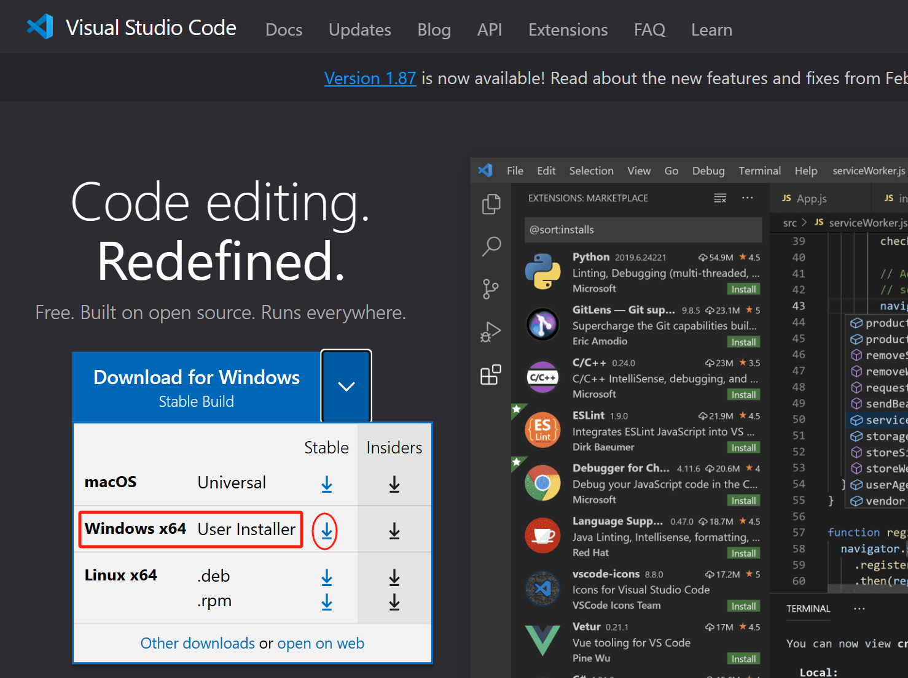

**建议不要安装到默认的 `C` 盘**，这里为了演示简化：

——**<mark> 路径中不要出现中文 </mark>**，避免以后可能遇到的一些莫名其妙的麻烦，不必要
（`GNU C/C++` 编译和调试器等等，对 `Windows` 和 中文环境的兼容性虽然已经很好了，但情况很复杂）

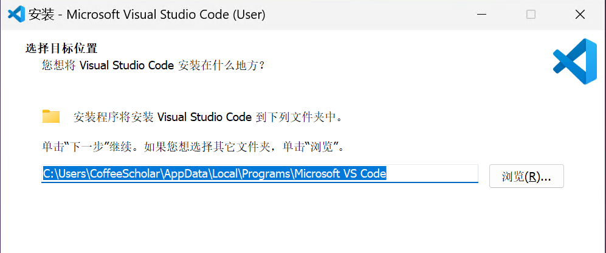

选中这两项方便一点：

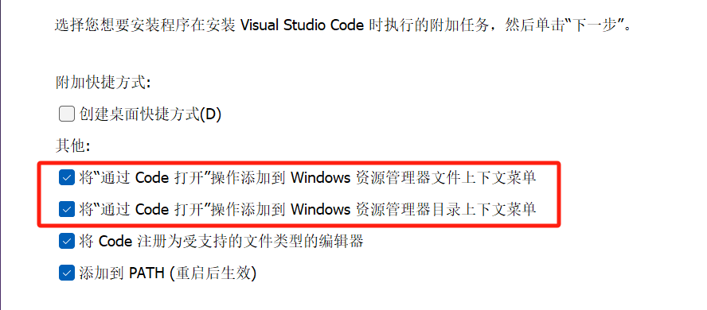

### 2.2. 安装中文语言包

- 安装完成后，运行 `VSCode`，按下快捷键：`Ctrl-Shift-X` 打开 `Extensions`（扩展）——或者点左边工具栏积木方块样子的图标；

- 在顶部的搜索栏输入：`Chinese` 并稍等符合条件的扩展包列表加载，

- 选择下面的 `Chinese (Simplified) (简体中文) Language Pack for Visual Studio Code`，

- 选中并在右侧点击 `Install`，安装中文语言包扩展：

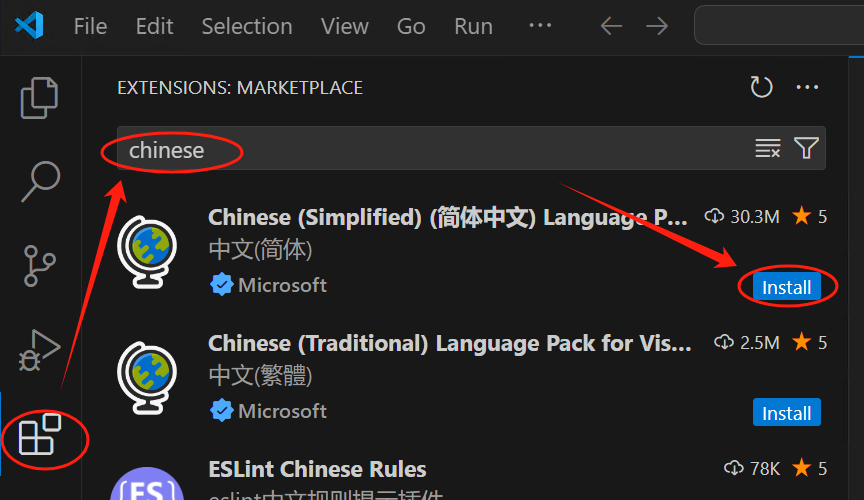

- 安装完成后，`VSCode` **右下角**会弹出消息提示 `更改语言并重新启动`，
  点击 `Change Language and Restart`，`VSCode` 自动重启后就是中文环境了。

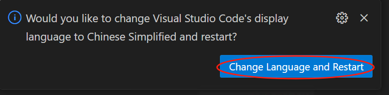

### 2.3.（此步跳过，后面自动安装）手动安装、配置 `C/C++` 扩展

很多教程都会有这一步，本教程在后面步骤会自动安装，此处跳过。

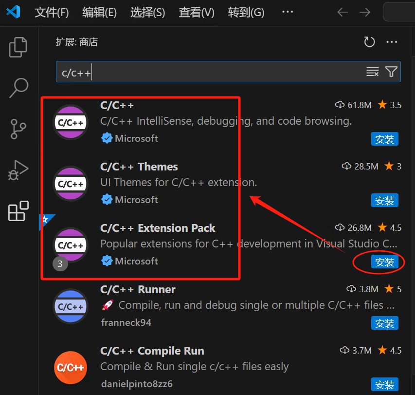

## 3. 编写、运行你的第一段 `C/C++` 代码

### 3.1. 打开文件夹

在 `VSCode` 中选择一个文件夹来保存你的代码，例如：`D:\MyCode\Learn_C`

> 注意：<mark> 路径和文件名中不要带空格、中文 </mark>，避免后续编译、调试时无法预料的错误。
> 
> 目前发现，主要是调试时对**中文路径和中文文件名**支持仍有问题（不是 `gdb` 的问题，初步测试判断是 `VSCode` 终端环境有差异，待深入排查）。

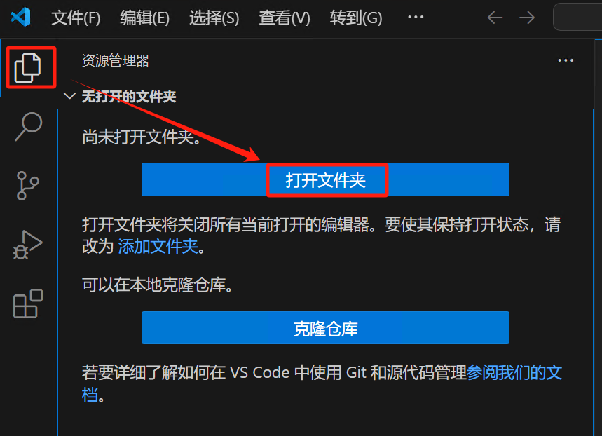

### 3.2. 新建 C 文件

在 `VSCode` 左侧的`资源管理器`中，点右上角的 `新建文件`， 

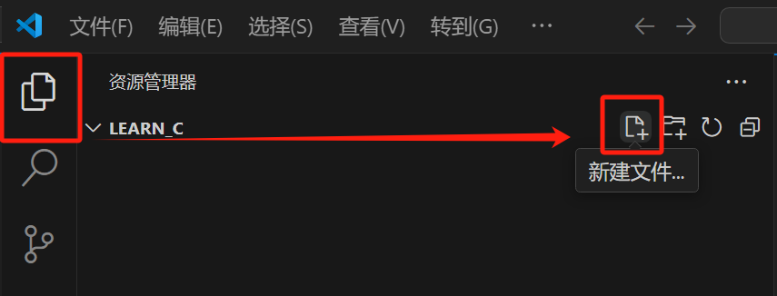

并为创建的文件取个名字比如 `HelloWorld.c`（英文），不需要内容

——注意扩展名用 `.c` 或 `.cpp`，`VSCode` 会自动识别并启用对应语言的扩展：

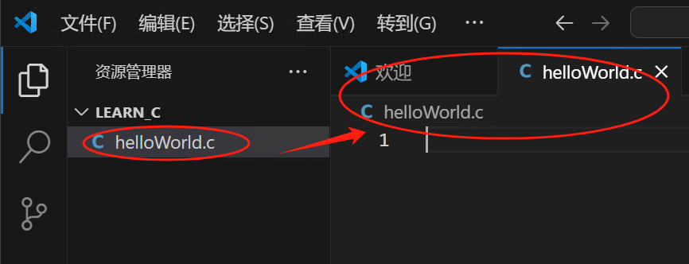

### 3.3. 自动安装扩展

稍等，右下角提示安装推荐的扩展包：

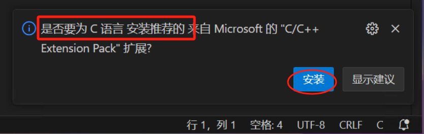

——接受，等扩展安装完毕，然后<mark>【重新运行 VSCode】</mark>——关闭，再运行。

### 3.4. 编写代码

 重新运行后，在右侧编辑区域编写代码并保存（按 `Ctrl + S`），粘贴下方 `程序员打开数字世界的第一个魔法口令`：

```c
#include <stdio.h>
void main() {
  printf("Hello World!");
}
```

### 3.5. 运行代码

点击编辑区域右上角类似 `播放` 按钮，运行和调试：

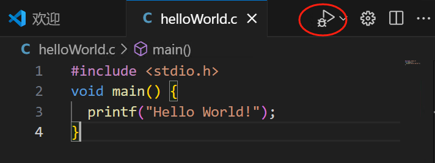

### 3.6. 自动配置 C/C++ 环境

`VSCode` 会**自动提示配置编译器**，选中默认项：

——`VSCode` 已经识别到之前安装并在 `Path` 环境变量配置过的 `gcc.exe`：

——这里发现<mark> **之前自动装好扩展必须重启一下 VSCode** </mark>，否则 `VSCode` 经常无法自动识别 `gcc`

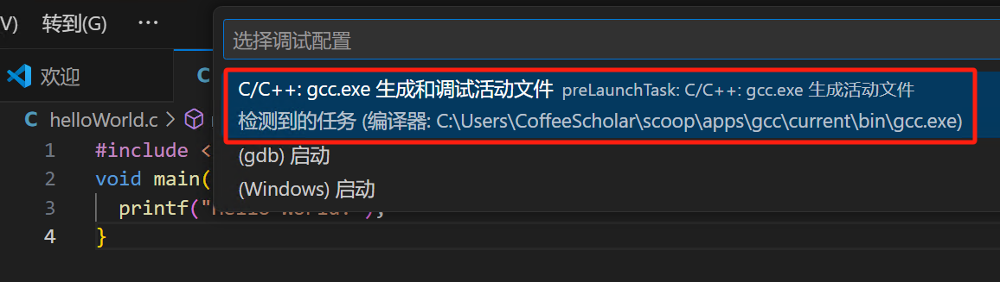

+ **关闭右下角的提示**（来源为 `CMake Tools` 的提示——短期内用不上 `CMake`，有个印象就好）：
  
  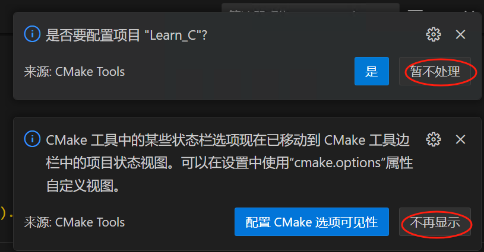

### 3.7. 自动产生任务配置文件

左侧`资源管理器`看到多了一个文件夹、两个文件：

- `.vscode`：`VSCode` 自动创建的用于存放配置文件的文件夹；
+ `tasks.json`：负责编译代码为可执行的 `exe` 文件的配置；
  
  ——正是其它教程需要手工配置的文件之一，这里**自动生成了**，**以后再深入学习**；

+ `helloWorld.exe`：`gcc` 对你的代码进行编译生成的 `可执行文件`，调试、运行都离不开它。

### 3.8. 查看运行结果

在底部输出窗口能看到类似下面的运行结果：

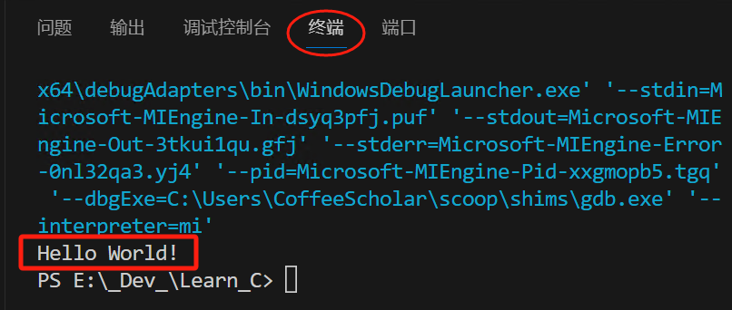

### 3.9. 运行和调试

下拉菜单中选 `运行`，`VSCode` 会记住上一次的操作，以后不用每次都按旁边的下拉菜单来选择。

——运行和调试有什么区别？后续调试代码会用到：

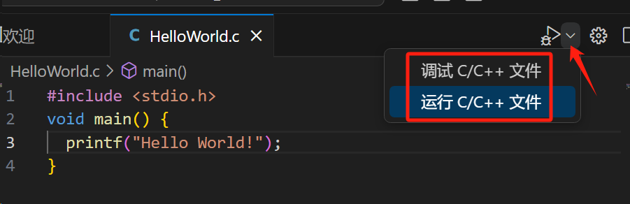

已经了解调试的同学，可以加断点调试测试一下配置是否正常，代码会停在加了断点这一行，并等待处理：

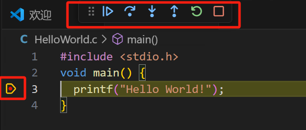

## 4. 完事，几个常用扩展

这时候装几个常用扩展（按照前面装语言包的方式）：

+ <mark> 必装扩展 </mark>：`Error Lens` ——在出错的代码旁显示错误信息，<mark> 方便定位错误位置 </mark>（默认在终端输出窗口）。
  下面的例子中故意制造了一个错误：
  
  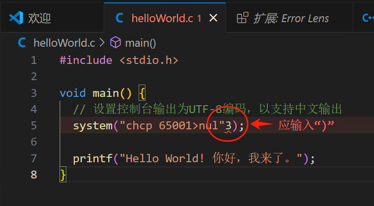

+ <mark> 必装扩展 </mark>：`Error Gutters`——配合上一个扩展，在警告、出错的代码前显示图标：
  
  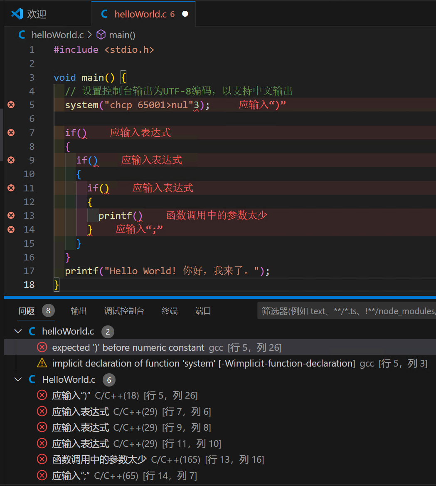

+ 推荐扩展：`C/C++ Compile Run`
  
  ——编译、调试和运行 `C/C++` 代码的帮助扩展，**自动配置**已经安装的 `gcc/g++/gdb`
  
  ——快捷键：`F5` 编译、调试运行，`F6` 编译、运行
  
  ——其实有它，入门学习基本够用了，可以跳过以上所有步骤。 

+ 推荐扩展：`Code Runner`（注意，不是另外一个 `C/C++ Runner`）——同上，二选一即可
  
  ——快捷键：`Ctrl + Alt + N`

+ 这个扩展支持更多的语言，如 `Java`、`C#`、`Python` 等等，因为同时在学习 `Python` 所以装了这个扩展：

+ 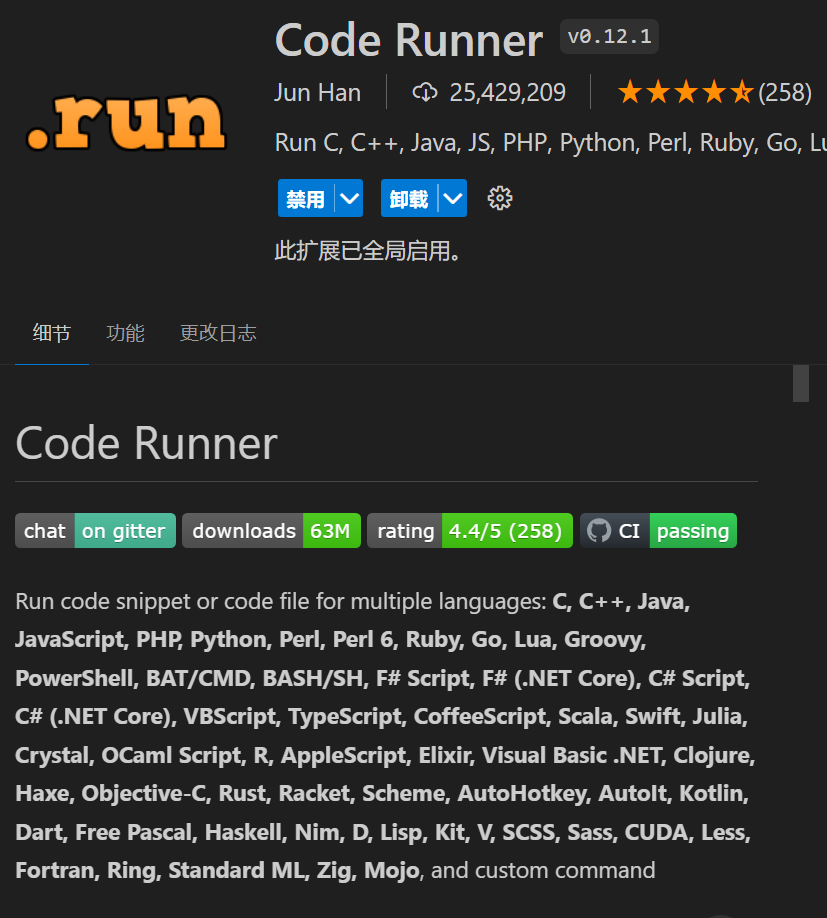

+ 可选扩展：`Indent-Rainbow`——用彩虹色显示缩进，方便对齐——在 `Python` 中非常有用；
  ——类似的，还有<u>彩虹括号</u>、<u>彩虹花括号</u>，已经内置了：
  
  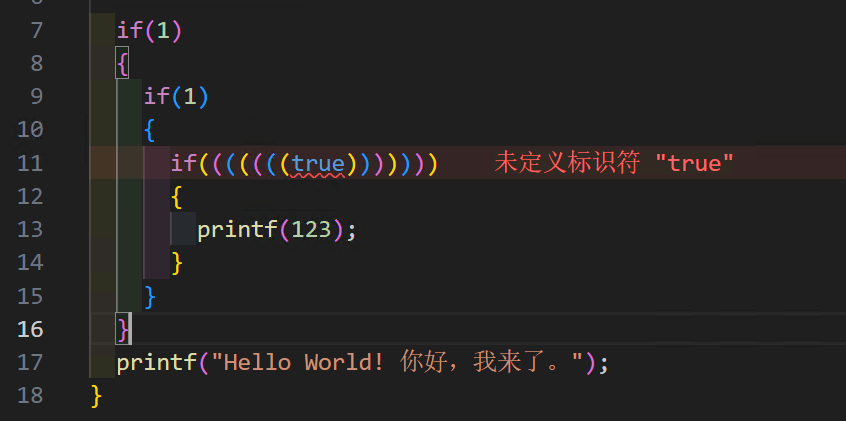

+ 更多更多，层出不穷，眼花缭乱，还是缓一缓，专注于【<mark>先入门</mark>】吧。

## 5. 常见问题：中文输出乱码

假如给前面的代码的输出内容加上中文：

```c
#include <stdio.h>
void main() {
  printf("Hello World! 你好，我来了。");
}
```

运行，查看下方输出内容中出现看不懂的乱字符，俗称乱码，其实是终端环境没能正常识别字符集的问题：

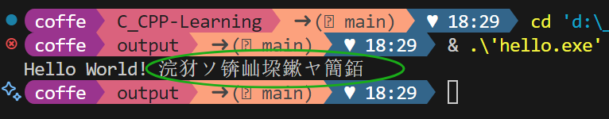

解决方法有两种：

+ 改变 `VSCode` 的终端相关设置——在其它电脑上运行需要重新配置；

+ 改变 Windows 环境的字符集设置——副作用太大；

+ 代码中进行处理——与环境设置无关。

前两种方法改变了终端运行环境设置，还可能会干扰其它功能，所以推荐最后一种方法：

```c
#include <stdio.h>
#include <stdlib.h>

void main() {
  // 设置控制台输出为UTF-8编码，以支持中文输出
  system("chcp 65001>nul"); 

  printf("Hello World! 你好，我来了。");
}
```

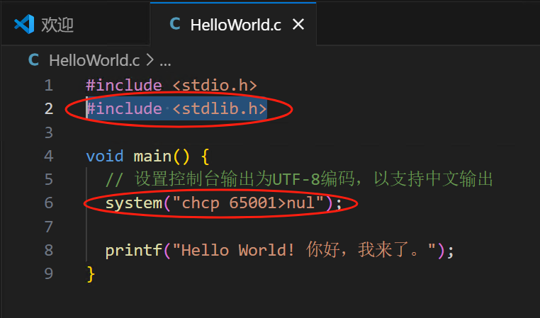

新增的两行代码中：`chcp 65001` 表示把系统的字符集切换为 `65001 (UTF-8)`，

——与 `VSCode` 编辑代码时的默认字符集一致：

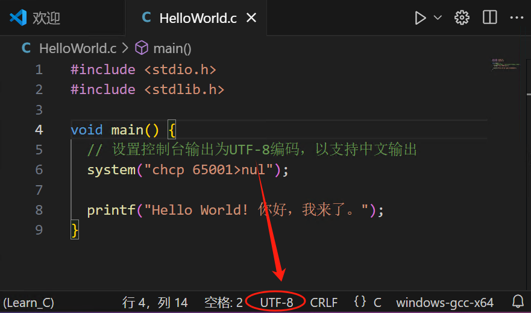

所以，如果你的编辑环境的编码为 `GB2312` 的话，代码中的 `65001` 改为 `936`也能正常输出。

——最好保持 `UTF-8` 适用性更广泛。

——以后你会学习到<u>字符集相关的知识</u>，这是很容易出现混乱的若干历史包袱之一，属于<mark> 程序员必经心魔 </mark>。

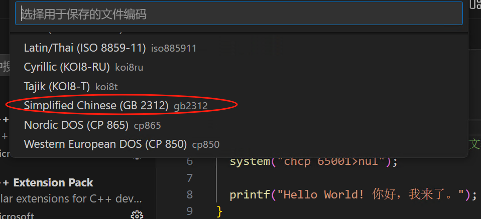

> `Windows` 系统中默认也是 `936`，
> 很多教程教你去修改 `Windows` 系统的**默认字符集**为 `Unicode`，
> ——显然，比更改 `VSCode` 终端环境参数的影响更大，**会带来更多无法预料的麻烦**。

**<mark> 知道背后的原理，以后能少很多麻烦，或者遇到问题知道原因 </mark>**

> **这也是很多教程中存在问题的原因：**
> **——不是确切的知道为什么、不知道有没有更好的解决方案。**

---

## 6. 大功告成，新手，接任务吧

目前已经能让你在新手村附近打怪了，后续还需要进一步了解和熟悉以下方面的配置：

> `c_cpp_properties.json`        配置 `C/C++` 语言的基本设置
> `launch.json`                          配置调试操作相关的设置 
> `tasks.json`                             配置编译相关的设置

——具体细节可参考其它教程，有很多很多。

#### 有了 `Scoop`，先顺手装两个强大的工具：

```powershell
# 添加一个官方软件包仓库
scoop bucket add extras
# 安装两个非常强大的工具
scoop install everything ffmpeg
```

`Everything`，顾名思义，就是 `everything` 的意思，非常方便

### 6.1. 任务一：搜索了解一下 `Everything`

——它知道你的电脑上的每个文件/文件夹 `everything` 在哪个犄角旮旯里，快给它设置个快捷键吧。

### 6.2. 任务二：搜索了解一下 `ffmpeg`

——最牛的跨平台音视频全方位解决方案，以后你将发现它就像 `原力` 一样，`无处不在`。

——几乎所有的音视频转码、编辑工具，其实**都是调用它**实现的。

---
