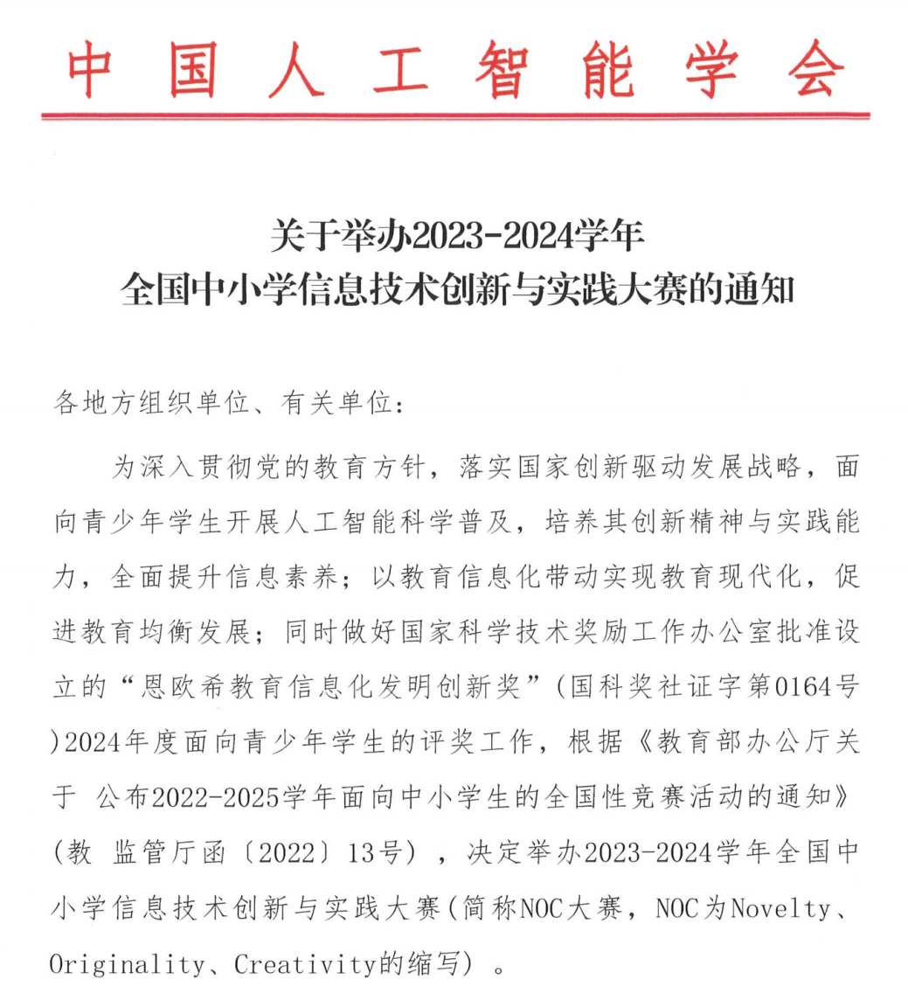
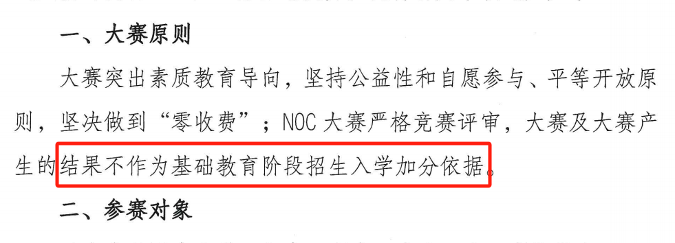
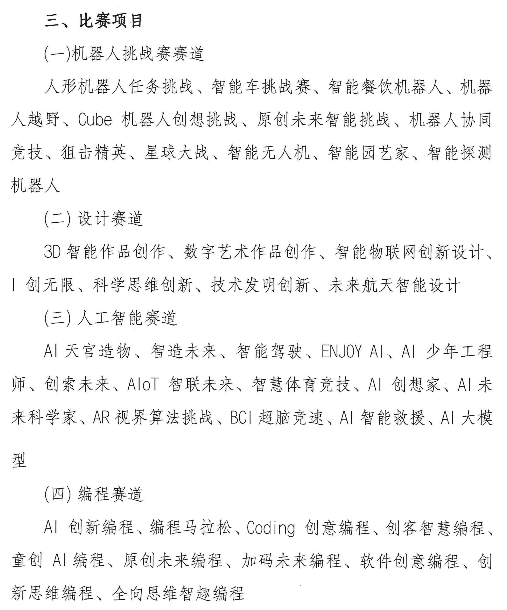
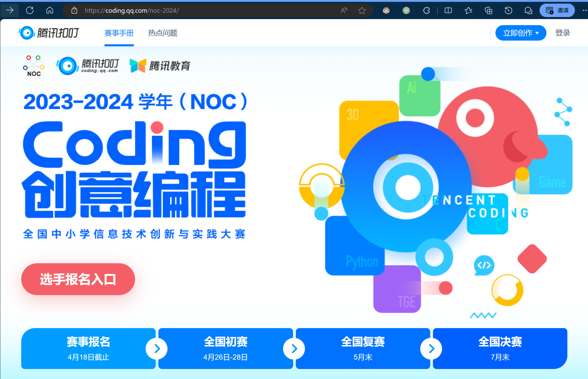
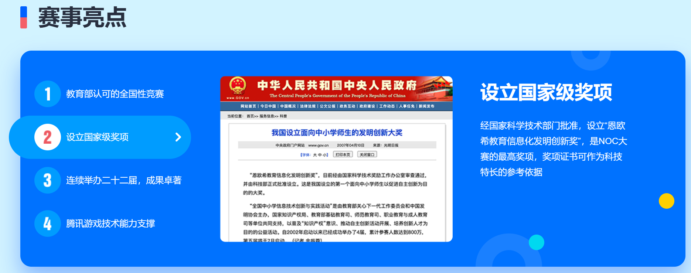
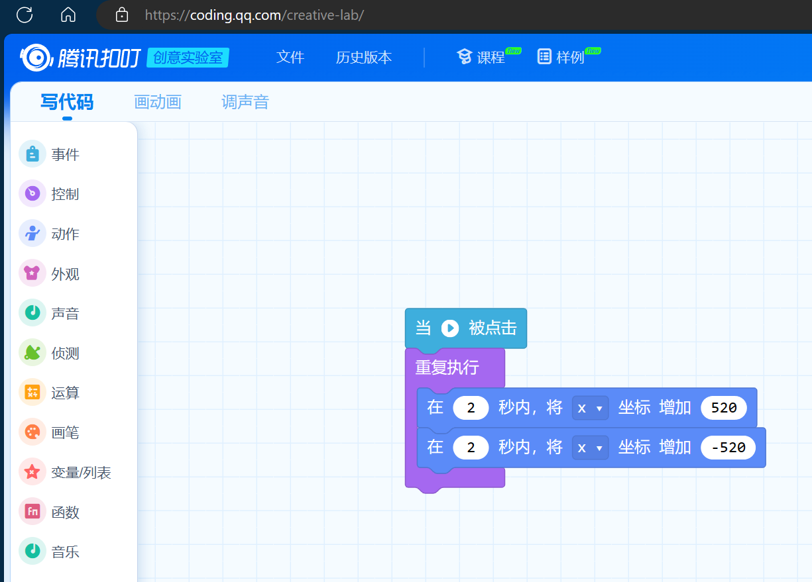

# 白名单赛事：那些你不知道的

最近，NOC 2024 报名开始了。想必很多家长朋友是知道 NOC 的，这里简单提一下带过。

> `NOC` 简称 创新大赛，全称是《`全国中小学信息技术创新与实践大赛`》，是“白名单赛事”之一。
> 
> `NOC` 为 `Novelty`、`0riginality`、`Creativity` 的缩写，顾名思义鼓励新颖性、原创性和创造性。

# 一、NOC 2024 通知

# 二、今年最有意思的一点

目前不知道其它省的情况，我看到某省的通知里，有一句话非常有意思：

> 大赛及大赛产生的结果不作为基础教育阶段招生入学加分依据。

👍👏🙌 👍👏🙌 👍👏🙌

点赞、鼓掌、支持！点赞、鼓掌、支持！点赞、鼓掌、支持！

如果其它省的朋友收到通知，帮忙仔细看看有没有类似的表达。

接下来，聊聊白名单赛事的本质，以及那些培训机构不愿意家长们知道的事情。

# 三、简单聊聊白名单赛事

白名单赛事的来龙去脉就不重复了，大家都知道，或者说有无数人介绍过了。

来聊点儿别人没聊过，或者不想聊甚至不敢聊的。

以下仅针对信息素养类，尤其编程相关的比赛，以及部分其它比赛如无人机等。

## 1. 白名单赛事的评奖模式

这类白名单赛事，省赛往往都是从参赛人数中取成绩占前10% 的评为一等奖，二等奖以此类推就不细说了。

——简而言之，有1000人参赛，前100人能获得一等奖。

很多人可能要说了：你说这事儿我知道，还用你废话？

且耐心听我把整个事情给大家捋清楚。

## 2. 白名单赛事的赛项

家长朋友们都知道，“白名单”出来之前，充斥着各种赛事，非常混乱。

白名单出来之后，只有符合教育部准入要求的能列入名单，能合规开展相应比赛。

从家长的角度来说，似乎一下子清爽了不少。

然而，这只是假象。

白名单赛事有没有起到规范全国的竞赛环境的作用？起到了，而且作用非常大。

然而，规范之后，有些事情变好了，有些事情并没有变，或者说只是形式变了。

翻开随便一个赛事来看，就拿 NOC 举例：

**分为四个赛道：**

> （一）机器人挑战赛赛道
> 人形机器人任务挑战、智能车挑战赛、智能餐饮机器人、机器人越野、Cube 机器人创想挑战、原创未来智能挑战、机器人协同竞技、狙击精英、星球大战、智能无人机、智能园艺家、智能探测机器人。

> （二）设计赛道
> 3D智能作品创作、数字艺术作品创作、智能物联网创新设计创无限、科学思维创新、技术发明创新、未来航天智能设计。

> （三）人工智能赛道Al天宫造物、智造未来、智能驾驶、ENJOYAI、A!少年工程师、创索未来、AIOT智联未来、智慧体育竞技、AI创想家、Al未来科学家、AR视界算法挑战、BCI超脑竞速、AI智能救援、Al大模型。

> （四）编程赛道
> Al 创新编程、编程马拉松、Coding 创意编程、创客智慧编程童创 A|编程、原创未来编程、加码未来编程、软件创意编程、创新思维编程、全向思维智趣编程。

家长朋友们一定都懵了吧？太多了，选哪个呢？眼花缭乱。

接下来从编程赛道举例：

### 2.1. 分析一个案例：Coding 创意编程

编程赛道的 `Coding 创意编程` 合作方是腾讯。

腾讯官网介绍：[2024年NOC扣叮创意编程](https://coding.qq.com/noc-2024/)

究竟什么是 `Coding 创意编程`？点进去看一下，界面如此：

明白了，类似于 `Scratch` 的图形化编程。

报名前，通知发到学校。学校又通知 + 组织家长进行报名培训和报名答疑。

培训和答疑过程中，了解到：比赛还分小学低年级组、小学高年级组、初中组、高中组。

每个组别参赛人数不限。

- 一个赛道，分为若干赛项

- 一个赛项分为若干年龄段

- 每个赛项取前 10% 为一等奖

到这里都挺好，我们来**做一个简单的计算：**

> 假设，在一个省，每个赛项的每个年龄段有 1000 人报名，该年龄段大概有 100 人拿到一等奖。
> 
> 如果每个年龄段报名不均匀呢？一样，都是总数 10% 的人拿到一等奖。
> 
> 可见，仅仅 `Coding 创意编程` 一个赛项，假如总共有 4000 人报名，那就有 400 个一等奖。

这些机构最喜欢对家长说的一句话就是：

> 参加某某比赛，获奖比例很高。

很多家长一听就来劲了，因为都市传说中，学校招生的时候，有省一等奖如何如何，省二等奖如何如何。

但没考虑另外一个问题：

> 招生一方，会不会头疼？

仅仅一个赛项，几百人拿着一等奖，不知道招生负责人怎么想。

还记得最近的电影《学爸》里，男主为了孩子能上心仪的学校，想出来的办法是让孩子学编钟 🤣？

## 2. 白名单赛事的定位

到这里，是不是已经反应过来了：怎么有那么多一等奖、二等奖？

没错，仅仅编程赛道有 10 个赛项，对应着大约有 4000 个省级一等奖。